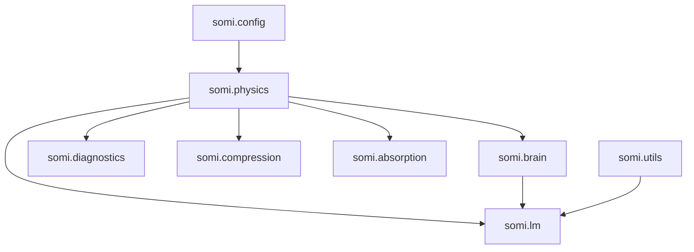

# Target Architecture

## Dependency graph

## Canonical module ownership

- `somi.physics`: field/geometry/settling/hamiltonian/calibration/neuromodulation primitives
- `somi.brain`: circuit architecture and growth orchestration
- `somi.lm`: LM wrapper + pure SSM-SOMI model + growth + distillation
- `somi.compression`: compression strategies
- `somi.absorption`: knowledge absorption and integrity checks
- `somi.diagnostics`: pathology and health diagnostics
- `somi.visualization`: plotting and scan outputs
- `somi.training`: training strategies and test-time learning
- `somi.utils`: shared utility components

## Rules enforced in rebuild

1. No `sys.path` insertion hacks
2. No imports from legacy workspace folders
3. One canonical implementation owner per concept
4. Experiments import from `somi.*` only
5. Validation required before migration signoff
